dddd

Primero nos bajaremos una màquina virtual para VirtualBox ya preconstruida para no perder tiempo.
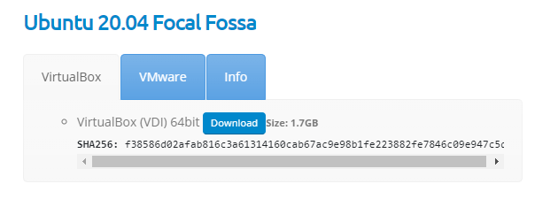

Una vez bajada la
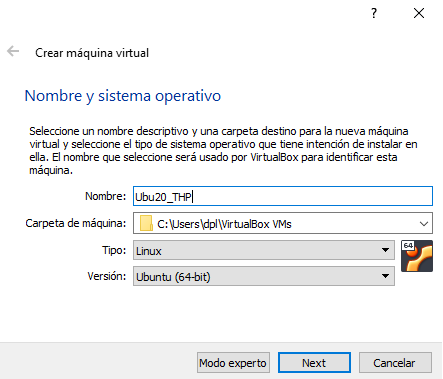
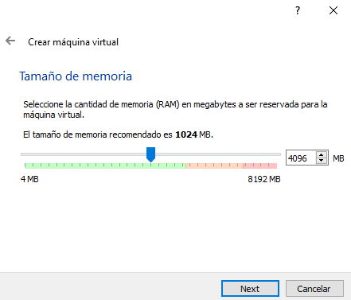
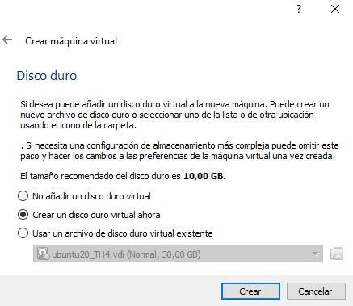
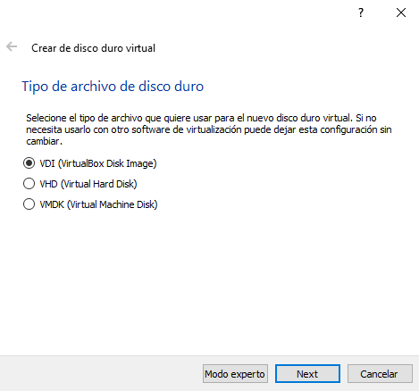
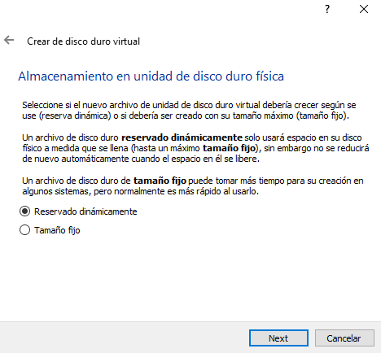
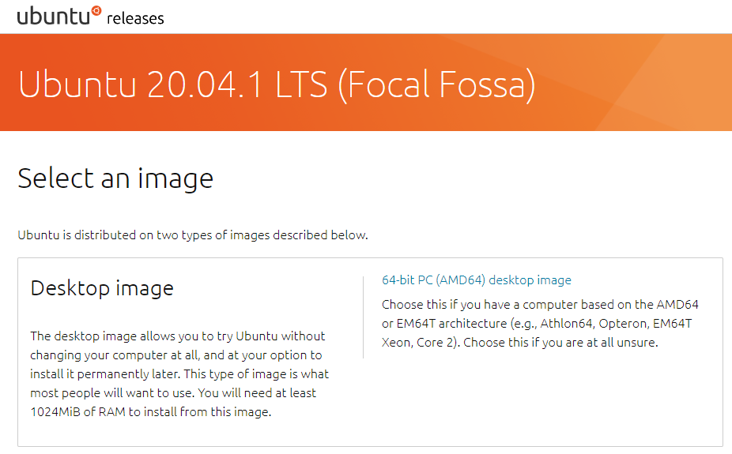

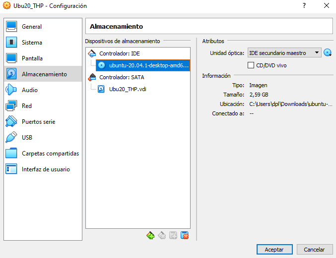
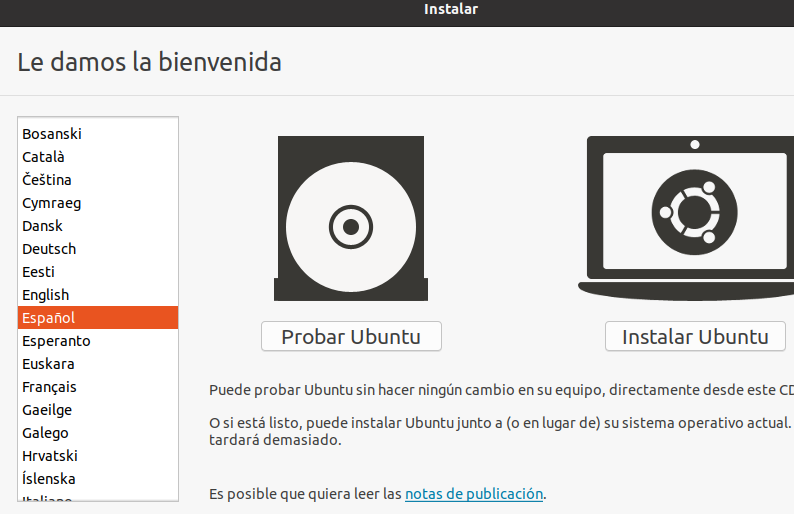
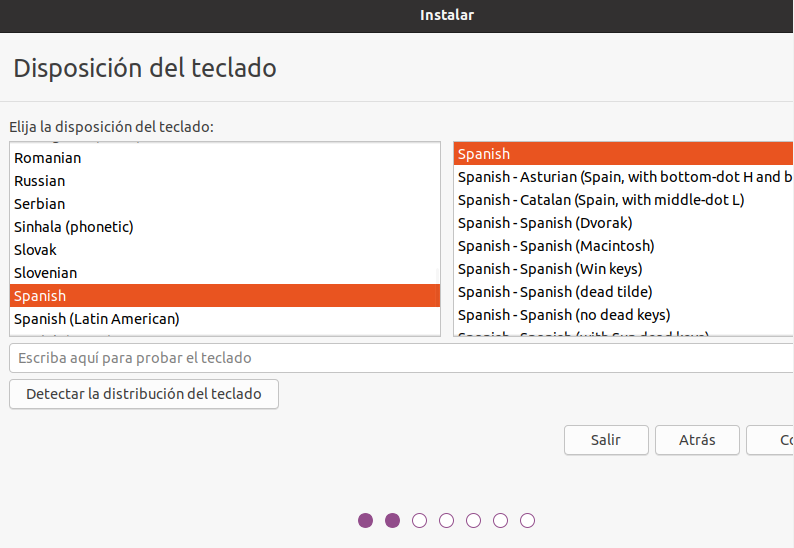
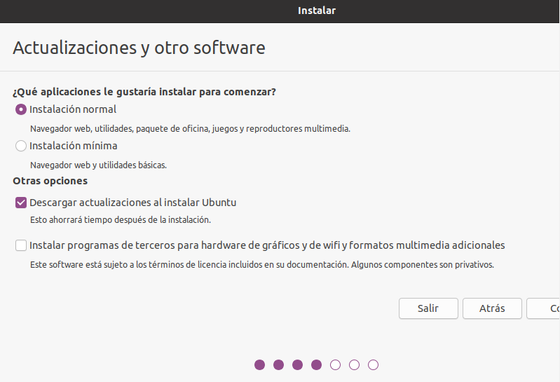
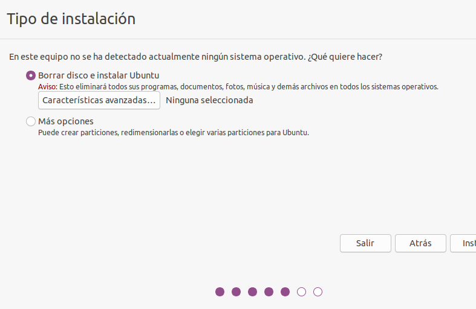
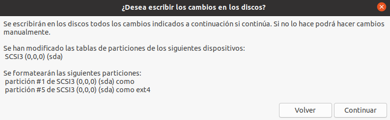
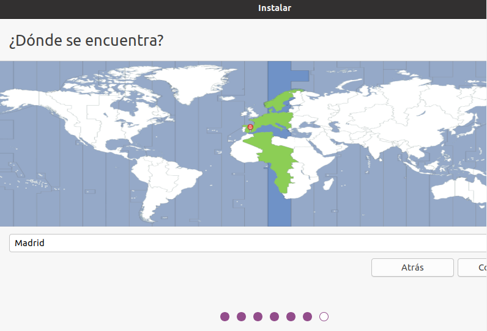
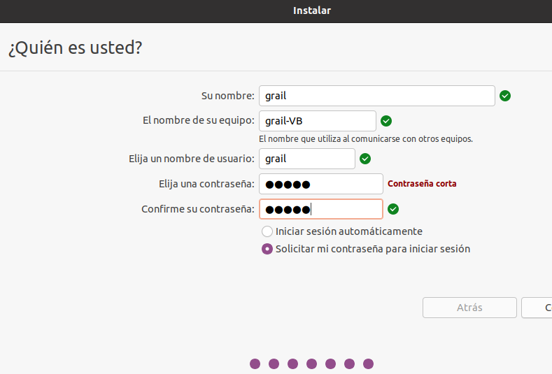
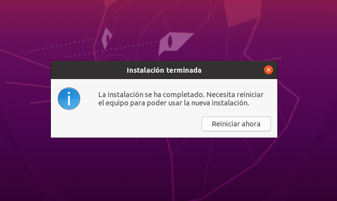

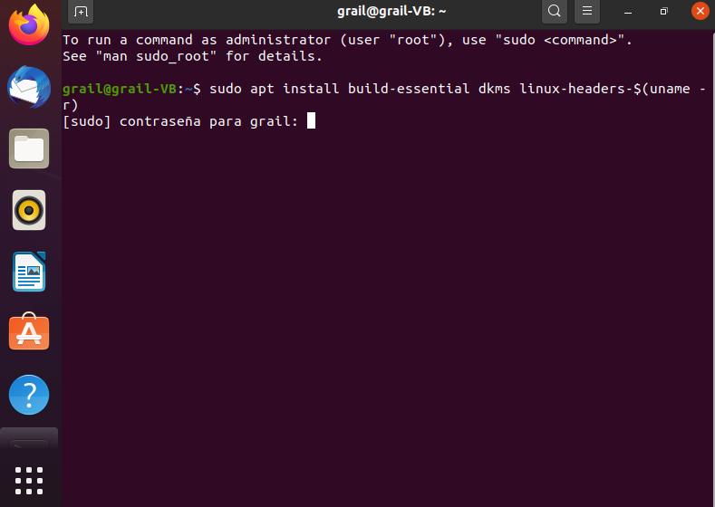

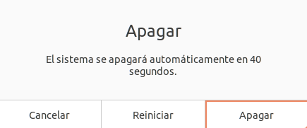

https://www.digitalocean.com/community/tutorials/how-to-install-and-use-docker-on-ubuntu-20-04
https://www.digitalocean.com/community/tutorials/how-to-install-and-use-docker-compose-on-ubuntu-20-04
First, update your existing list of packages:

sudo apt update
 
Next, install a few prerequisite packages which let apt use packages over HTTPS:

sudo apt install apt-transport-https ca-certificates curl software-properties-common
 
Then add the GPG key for the official Docker repository to your system:

curl -fsSL https://download.docker.com/linux/ubuntu/gpg | sudo apt-key add -
 
Add the Docker repository to APT sources:

sudo add-apt-repository "deb [arch=amd64] https://download.docker.com/linux/ubuntu focal stable"
 
Next, update the package database with the Docker packages from the newly added repo:

sudo apt update
 
Make sure you are about to install from the Docker repo instead of the default Ubuntu repo:

apt-cache policy docker-ce
 
You’ll see output like this, although the version number for Docker may be different:

Output of apt-cache policy docker-ce
docker-ce:
  Installed: (none)
  Candidate: 5:19.03.9~3-0~ubuntu-focal
  Version table:
     5:19.03.9~3-0~ubuntu-focal 500
        500 https://download.docker.com/linux/ubuntu focal/stable amd64 Packages
 
Notice that docker-ce is not installed, but the candidate for installation is from the Docker repository for Ubuntu 20.04 (focal).

Finally, install Docker:

sudo apt install docker-ce
 
Docker should now be installed, the daemon started, and the process enabled to start on boot. Check that it’s running:

sudo systemctl status docker
 
The output should be similar to the following, showing that the service is active and running:

Output
● docker.service - Docker Application Container Engine
     Loaded: loaded (/lib/systemd/system/docker.service; enabled; vendor preset: enabled)
     Active: active (running) since Tue 2020-05-19 17:00:41 UTC; 17s ago
TriggeredBy: ● docker.socket
       Docs: https://docs.docker.com
   Main PID: 24321 (dockerd)
      Tasks: 8
     Memory: 46.4M
     CGroup: /system.slice/docker.service
             └─24321 /usr/bin/dockerd -H fd:// --containerd=/run/containerd/containerd.sock
             
Installing Docker now gives you not just the Docker service (daemon) but also the docker command line utility, or the Docker client. We’ll explore how to use the docker command later in this tutorial.
