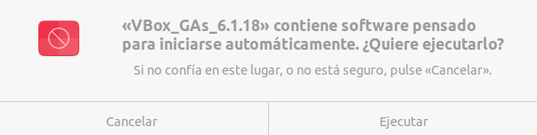

dddd

Primero nos bajaremos una màquina virtual para VirtualBox ya preconstruida para no perder tiempo.

Una vez bajada la

https://www.digitalocean.com/community/tutorials/how-to-install-and-use-docker-on-ubuntu-20-04
https://www.digitalocean.com/community/tutorials/how-to-install-and-use-docker-compose-on-ubuntu-20-04
First, update your existing list of packages:

sudo apt update
 
Next, install a few prerequisite packages which let apt use packages over HTTPS:

sudo apt install apt-transport-https ca-certificates curl software-properties-common
 
Then add the GPG key for the official Docker repository to your system:

curl -fsSL https://download.docker.com/linux/ubuntu/gpg | sudo apt-key add -
 
Add the Docker repository to APT sources:

sudo add-apt-repository "deb [arch=amd64] https://download.docker.com/linux/ubuntu focal stable"
 
Next, update the package database with the Docker packages from the newly added repo:

sudo apt update
 
Make sure you are about to install from the Docker repo instead of the default Ubuntu repo:

apt-cache policy docker-ce
 
You’ll see output like this, although the version number for Docker may be different:

Output of apt-cache policy docker-ce
docker-ce:
  Installed: (none)
  Candidate: 5:19.03.9~3-0~ubuntu-focal
  Version table:
     5:19.03.9~3-0~ubuntu-focal 500
        500 https://download.docker.com/linux/ubuntu focal/stable amd64 Packages
 
Notice that docker-ce is not installed, but the candidate for installation is from the Docker repository for Ubuntu 20.04 (focal).

Finally, install Docker:

sudo apt install docker-ce
 
Docker should now be installed, the daemon started, and the process enabled to start on boot. Check that it’s running:

sudo systemctl status docker
 
The output should be similar to the following, showing that the service is active and running:

Output
● docker.service - Docker Application Container Engine
     Loaded: loaded (/lib/systemd/system/docker.service; enabled; vendor preset: enabled)
     Active: active (running) since Tue 2020-05-19 17:00:41 UTC; 17s ago
TriggeredBy: ● docker.socket
       Docs: https://docs.docker.com
   Main PID: 24321 (dockerd)
      Tasks: 8
     Memory: 46.4M
     CGroup: /system.slice/docker.service
             └─24321 /usr/bin/dockerd -H fd:// --containerd=/run/containerd/containerd.sock
             
Installing Docker

Now gives you not just the Docker service (daemon) but also the docker command line utility, or the Docker client. We’ll explore how to use the docker command later in this tutorial.
Installing Docker Compose
To make sure we obtain the most updated stable version of Docker Compose, we’ll download this software from its official Github repository.

First, confirm the latest version available in their releases page. At the time of this writing, the most current stable version is 1.27.4.

The following command will download the 1.27.4 release and save the executable file at /usr/local/bin/docker-compose, which will make this software globally accessible as docker-compose:

sudo curl -L "https://github.com/docker/compose/releases/download/1.27.4/docker-compose-$(uname -s)-$(uname -m)" -o /usr/local/bin/docker-compose
 
Next, set the correct permissions so that the docker-compose command is executable:

sudo chmod +x /usr/local/bin/docker-compose
 
To verify that the installation was successful, you can run:

docker-compose --version
 
You’ll see output similar to this:

Output
docker-compose version 1.27.4, build 40524192
Docker Compose is now successfully installed on your system. In the next section, we’ll see how to set up a docker-compose.yml file and get a containerized environment up and running with this tool.

git clone https://github.com/TheHive-Project/Docker-Templates.git
cd Docker-Templates/docker/thehive4-cortex3-misp-shuffle
mkdir elasticsearch_data
mkdir elasticsearch_logs
sudo docker-compose up
(just before docker-compose up I edited docker-compose.yml to set the ip of my machine just where there is misp hostname, otherwise issue with certs)

